# System Architecture

This page presents the complete data flow of Mochi-Metrics, from host metric collection to TFT display rendering.

## Data Flow Overview

```mermaid
graph LR
    subgraph Host["Host Machine"]
        OS["OS Metrics<br/>(CPU, RAM, GPU, Net, Disk)"]
        PS["psutil / gopsutil"]
        OS --> PS
    end

    subgraph Sender["Sender (Python / Go)"]
        Collect["Collect Metrics"]
        Build["buildPayload()"]
        Pub["MQTT Publish"]
        Collect --> Build --> Pub
    end

    subgraph Broker["MQTT Broker"]
        Topic["Topic: sys/agents/{host}/metrics/v2<br/>Payload: Metrics v2 JSON"]
    end

    subgraph Firmware["ESP8266 Firmware"]
        Sub["MQTT Subscribe<br/>(espMqttClientAsync)"]
        Parse["MetricsParser<br/>(parseMetricsV2Payload)"]
        Store["DeviceStore<br/>(per-device frames)"]
        Display["MonitorDisplay<br/>(dirty-region TFT)"]
        Sub --> Parse --> Store --> Display
    end

    subgraph Output["240x240 TFT"]
        TFT["ST7789 SPI Display<br/>(RGB565, 40MHz)"]
    end

    subgraph WebUI["Configuration"]
        Web["ESPAsyncWebServer<br/>REST API + Setup Portal"]
        Browser["Browser"]
        Web <--> Browser
    end

    PS --> Collect
    Pub -->|"MQTT 3.1.1"| Topic
    Topic -->|"Wildcard: +/metrics/v2"| Sub
    Display --> TFT
    Firmware -.-> Web
```

## Component Interactions

### Sender to Broker

The sender collects host metrics at a configurable interval (default 1Hz) and publishes a compact JSON payload:

- **Topic format**: `sys/agents/{hostname}/metrics/v2`
- **Payload**: Compact JSON with positional arrays (`cpu`, `ram`, `gpu`, `net`, `disk`)
- **QoS**: Configurable (default 0)

### Broker to Firmware

The ESP8266 firmware subscribes using wildcard `sys/agents/+/metrics/v2` for automatic device discovery, or specific topics in allowlist mode.

### Firmware Internals

1. **MQTTTransport** -- Async MQTT client with reconnect backoff (1s-5s), keepalive disabled, 30s silence detection
2. **MetricsParser** -- Validates schema version, extracts hostname from topic, parses JSON arrays into x10 fixed-point integers
3. **DeviceStore** -- Fixed-size array (max 8 devices), dirty-mask tracking per metric group for minimal redraws
4. **MonitorDisplay** -- Three-tier refresh: force-redraw (90ms), active (200ms), idle (1000ms); threshold-based color coding

### Web Configuration

The ESP8266 runs ESPAsyncWebServer on port 80:

| Endpoint | Method | Purpose |
|----------|--------|---------|
| `/api/v2/config` | GET/POST | Read/write monitor configuration |
| `/api/v2/status` | GET | Live status (MQTT state, device list) |
| `/monitor` | GET | Web UI setup page |

## Protocol Specification

See [Protocol Module](modules/protocol.md) for the complete Metrics v2 field definitions and rules.
