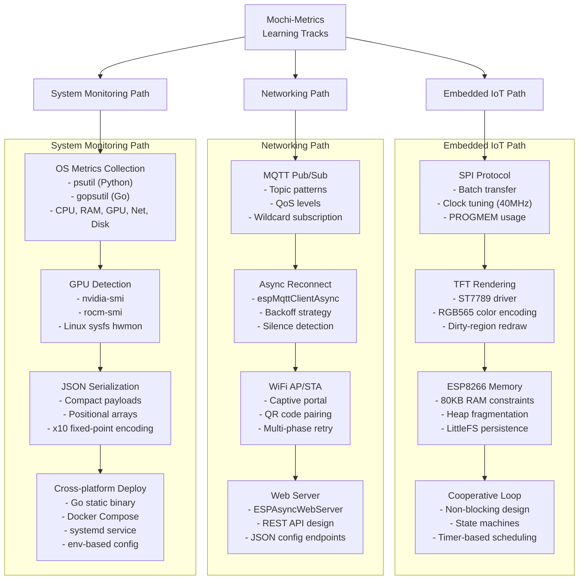

# Learning Path

This guide presents three learning tracks through Mochi-Metrics. Each track highlights specific technologies and concepts you can learn by studying the corresponding modules.

## Recommended Order

Start with the **Protocol spec** to understand the data format, then follow any track that interests you.

```
Protocol Spec --> Sender --> MQTT --> Firmware --> Display
```

## Learning Tracks



## Track Details

### Embedded IoT Path

Best for learners interested in microcontroller programming and display systems.

| Module | Key Technologies | Source Files |
|--------|-----------------|-------------|
| SPI Protocol | Batch SPI transfer, 40MHz clock, FIFO buffer (64 bytes) | `tft_driver.h` |
| TFT Rendering | ST7789 driver, RGB565 color, `drawCharScaled()` row-batch | `tft_driver.h`, `ui_components.h` |
| ESP8266 Memory | Heap monitoring, `ESP.getFreeHeap()`, LittleFS config | `monitor_config.h` |
| Cooperative Loop | Arduino `loop()`, non-blocking state machine, timer scheduling | `main.cpp` |

### Networking Path

Best for learners interested in IoT communication protocols and web services.

| Module | Key Technologies | Source Files |
|--------|-----------------|-------------|
| MQTT Pub/Sub | Topic hierarchy, wildcard `+`, QoS 0/1/2 | `mqtt_transport.h` |
| Async Reconnect | espMqttClientAsync, 1-5s backoff, keepalive=0, 30s silence check | `mqtt_transport.h`, `connection_policy.h` |
| WiFi Management | AP mode captive portal, STA multi-phase retry, QR code setup | `wifi_manager.h` |
| Web Server | ESPAsyncWebServer, REST JSON API, async request handling | `web_server.h` |

### System Monitoring Path

Best for learners interested in system metrics and cross-platform deployment.

| Module | Key Technologies | Source Files |
|--------|-----------------|-------------|
| OS Metrics | `psutil` / `gopsutil`, CPU/RAM/disk/network sampling | `sender_v2.py`, `main.go` |
| GPU Detection | nvidia-smi CLI, rocm-smi CLI, Linux sysfs `/sys/class/drm/` | `metrics_payload.py`, `payload.go` |
| JSON Serialization | Compact positional arrays, schema versioning (`v: 2`) | `metrics_payload.py`, `payload.go` |
| Deployment | Go cross-compile, Docker Compose, `senderctl.sh`, env config | `main.go`, `docker-compose.yml` |

## Next Steps

- [Architecture](architecture.md) -- Understand the full system data flow
- [Firmware Module](modules/firmware.md) -- Deep-dive into ESP8266 firmware
- [Sender Module](modules/sender.md) -- Explore metrics collection
- [Protocol Module](modules/protocol.md) -- Learn the Metrics v2 specification
