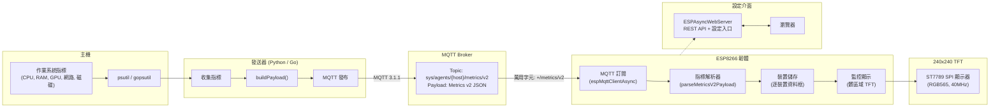

# 系統架構

本頁展示 Mochi-Metrics 的完整資料流，從主機指標收集到 TFT 顯示器渲染。

## 資料流總覽

## 元件互動

### 發送器到 Broker

發送器以可設定的間隔（預設 1Hz）收集主機指標並發布精簡 JSON 訊息：

- **Topic 格式**: `sys/agents/{hostname}/metrics/v2`
- **Payload**: 精簡 JSON，使用位置陣列（`cpu`, `ram`, `gpu`, `net`, `disk`）
- **QoS**: 可設定（預設 0）

### Broker 到韌體

ESP8266 韌體使用萬用字元 `sys/agents/+/metrics/v2` 訂閱以自動發現裝置，或在允許清單模式下訂閱特定 topic。

### 韌體內部架構

1. **MQTTTransport** -- 非同步 MQTT 客戶端，重連退避策略（1s-5s），停用 keepalive，30 秒靜默偵測
2. **MetricsParser** -- 驗證 schema 版本，從 topic 提取主機名稱，解析 JSON 陣列為 x10 定點整數
3. **DeviceStore** -- 固定大小陣列（最多 8 台裝置），逐指標群組的髒遮罩追蹤以最小化重繪
4. **MonitorDisplay** -- 三階段更新頻率：強制重繪（90ms）、活躍（200ms）、閒置（1000ms）；閾值色彩標示

### Web 設定介面

ESP8266 在 port 80 運行 ESPAsyncWebServer：

| 端點 | 方法 | 用途 |
|------|------|------|
| `/api/v2/config` | GET/POST | 讀寫監控設定 |
| `/api/v2/status` | GET | 即時狀態（MQTT 狀態、裝置清單）|
| `/monitor` | GET | Web UI 設定頁面 |

## 協定規格

詳見 [協定模組](modules/protocol.md) 的 Metrics v2 完整欄位定義與規則。
