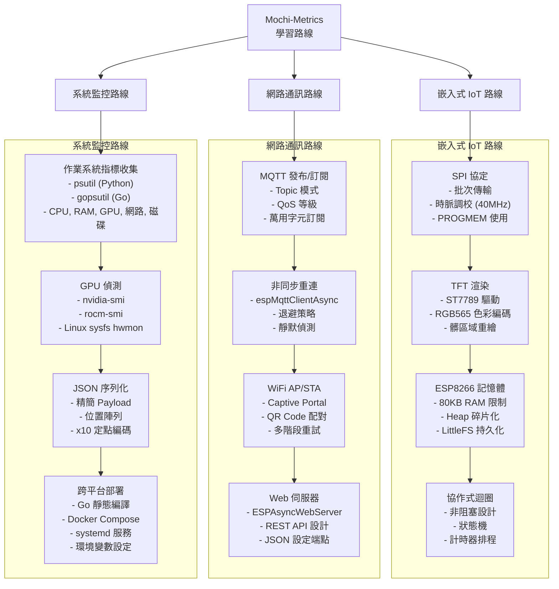

# 學習路線圖

本指南規劃了三條 Mochi-Metrics 學習路線。每條路線標示了對應模組中可學到的具體技術知識。

## 建議學習順序

先從 **協定規格** 理解資料格式，再依興趣選擇任一路線。

```
協定規格 --> 發送器 --> MQTT --> 韌體 --> 顯示
```

## 學習路線



## 路線詳細

### 嵌入式 IoT 路線

適合對微控制器程式設計與顯示系統感興趣的學習者。

| 模組 | 核心技術 | 原始碼檔案 |
|------|---------|-----------|
| SPI 協定 | 批次 SPI 傳輸、40MHz 時脈、FIFO 緩衝區（64 bytes）| `tft_driver.h` |
| TFT 渲染 | ST7789 驅動、RGB565 色彩、`drawCharScaled()` 行批次 | `tft_driver.h`、`ui_components.h` |
| ESP8266 記憶體 | Heap 監控、`ESP.getFreeHeap()`、LittleFS 設定 | `monitor_config.h` |
| 協作式迴圈 | Arduino `loop()`、非阻塞狀態機、計時器排程 | `main.cpp` |

### 網路通訊路線

適合對 IoT 通訊協定與 Web 服務感興趣的學習者。

| 模組 | 核心技術 | 原始碼檔案 |
|------|---------|-----------|
| MQTT 發布/訂閱 | Topic 階層、萬用字元 `+`、QoS 0/1/2 | `mqtt_transport.h` |
| 非同步重連 | espMqttClientAsync、1-5s 退避、keepalive=0、30s 靜默檢查 | `mqtt_transport.h`、`connection_policy.h` |
| WiFi 管理 | AP 模式 Captive Portal、STA 多階段重試、QR Code 設定 | `wifi_manager.h` |
| Web 伺服器 | ESPAsyncWebServer、REST JSON API、非同步請求處理 | `web_server.h` |

### 系統監控路線

適合對系統指標收集與跨平台部署感興趣的學習者。

| 模組 | 核心技術 | 原始碼檔案 |
|------|---------|-----------|
| 作業系統指標 | `psutil` / `gopsutil`、CPU/RAM/磁碟/網路取樣 | `sender_v2.py`、`main.go` |
| GPU 偵測 | nvidia-smi CLI、rocm-smi CLI、Linux sysfs `/sys/class/drm/` | `metrics_payload.py`、`payload.go` |
| JSON 序列化 | 精簡位置陣列、schema 版本控制（`v: 2`）| `metrics_payload.py`、`payload.go` |
| 部署 | Go 跨平台編譯、Docker Compose、`senderctl.sh`、環境變數設定 | `main.go`、`docker-compose.yml` |

## 下一步

- [系統架構](../architecture.md) -- 理解完整系統資料流
- [韌體模組](../modules/firmware.md) -- 深入 ESP8266 韌體
- [發送器模組](../modules/sender.md) -- 探索指標收集
- [協定模組](../modules/protocol.md) -- 學習 Metrics v2 規格
